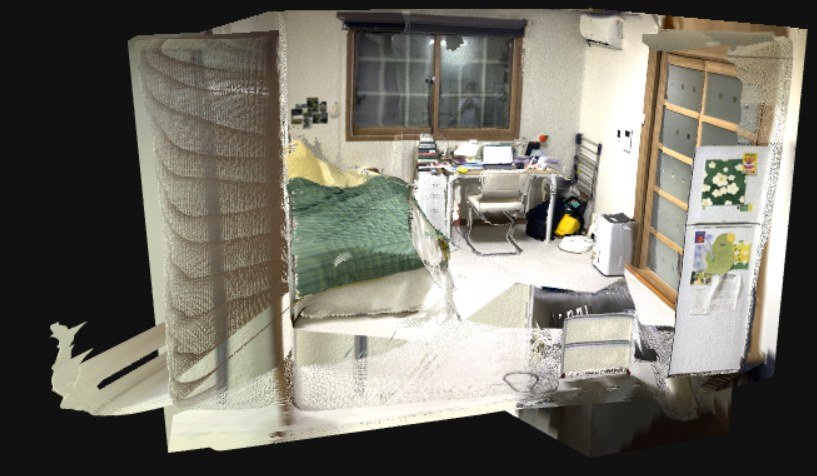
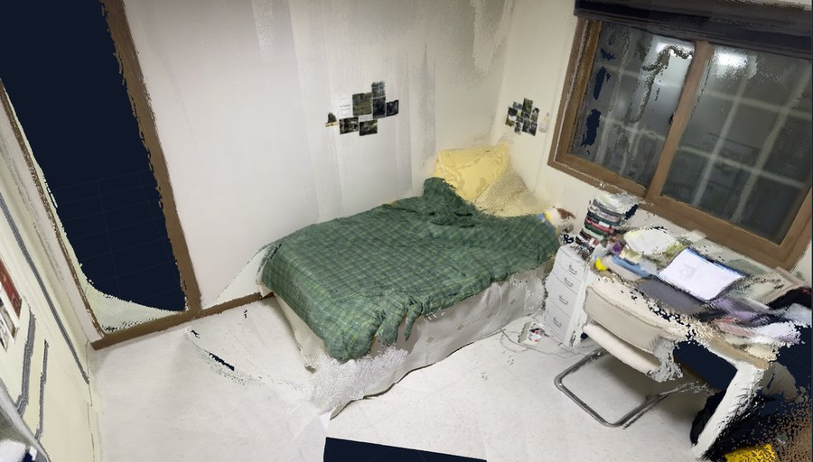
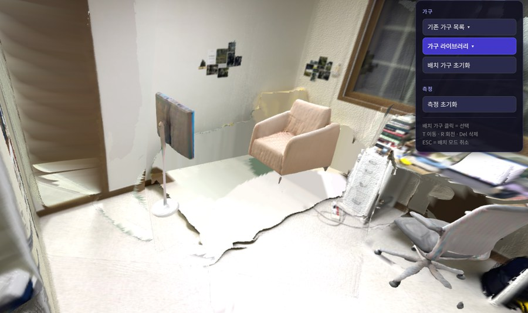
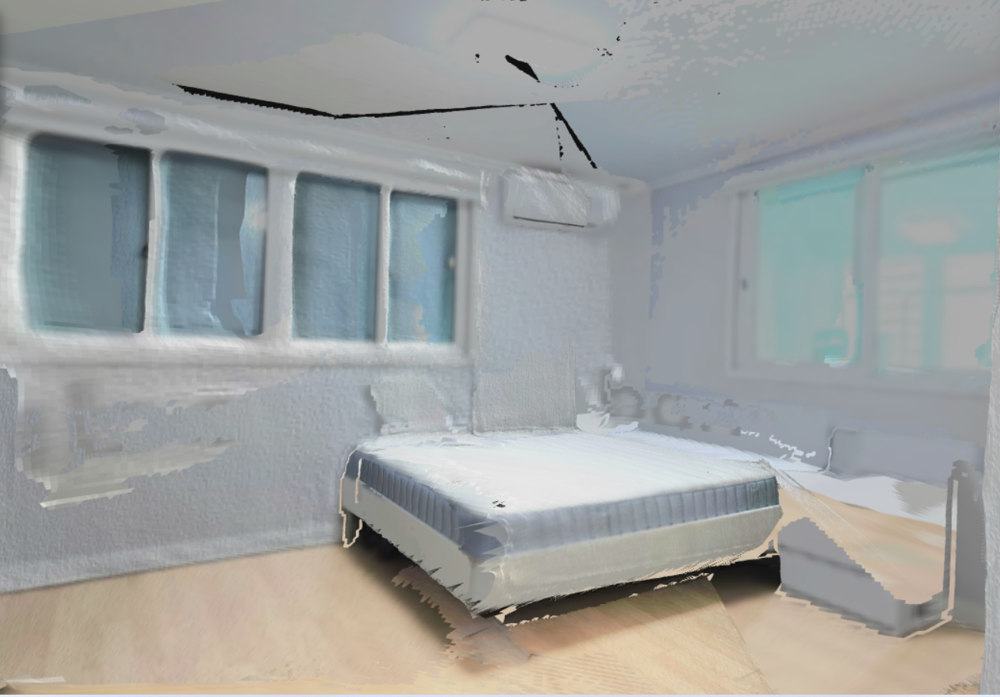
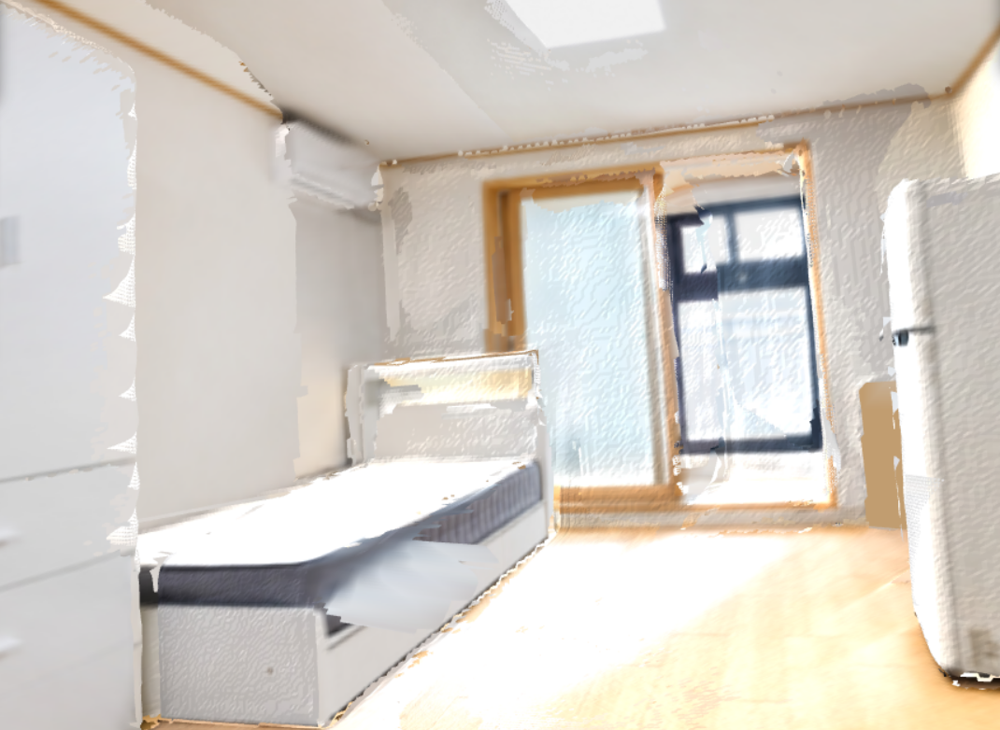

# 원룸3D - 매물 사진 기반 3D 공간 재구성 및 가구 배치

광각 원룸 사진 3~5장으로 실내 공간을 3D로 복원하고, 옵션 가구 제거와 사용자 가구 배치를 지원하는 팀 프로젝트입니다.

> 다양한 방에서 3D 복원과 객체 분리를 검증했으며, 최종 시연은 바닥 정렬·실측 스케일·가구 방향과 크기를 보정한 `room06`을 기준으로 구성했습니다.



## 프로젝트 개요

부동산 매물 사진은 광각 왜곡과 제한된 촬영 장수 때문에 실제 공간의 크기와 구조를 파악하기 어렵습니다. 평면도 기반 서비스는 정확한 평면도가 필요하고, VR 홈투어는 360도 카메라를 이용한 재촬영이 필요합니다.

이 프로젝트는 기존 매물 사진만으로 다음 정보를 제공하는 것을 목표로 했습니다.

- 방 구조와 공간감의 3D 시각화
- 옵션 가구 인식과 제거
- 보유·구매 예정 가구의 배치 가능성 확인
- 두 지점 사이 거리 측정

## 전체 파이프라인

```text
매물 사진 3~5장
  -> DUSt3R Point Map 추론 및 Global Alignment
  -> 좌표계 반전·바닥 평면 정렬·실측 스케일 보정
  -> YOLO11s 객체 탐지 + SAM2 마스크 보정
  -> 2D 마스크를 3D 포인트 라벨로 변환
  -> 옵션 가구 제거 + Backdrop 배경 보완
  -> TripoSR 가구 GLB 생성 및 실측 크기 매핑
  -> Three.js 기반 편집·거리 측정 뷰어
```

| 단계 | 주요 처리 | 결과 |
|---|---|---|
| 3D 복원 | 이미지 쌍 구성, DUSt3R Point Map 추론, Global Alignment | 실내 Point Cloud·Mesh |
| 공간 정렬 | 180도 좌표 반전, RANSAC 바닥 평면 검출, Y-up 정렬 | 수평으로 정렬된 공간 |
| 스케일 보정 | 실측 천장고 2.3m 기준 스케일 계산 | 미터 단위 거리 측정 |
| 객체 분리 | 가구 5종 YOLO11s 파인튜닝, SAM2 클릭·브러시 보정 | 이미지별 마스크와 3D 객체 라벨 |
| 빈 공간 보완 | 객체 제거 영역 뒤에 주변 Point Cloud 색상의 가상 벽·바닥 생성 | Backdrop이 적용된 방 Mesh |
| 가구 생성 | 배경 제거 후 TripoSR 단일 이미지 3D 복원, 실측 크기 매핑 | 배치 가능한 GLB 가구 |
| 사용자 뷰어 | 가구 표시·숨김, 추가·이동·회전·삭제, 거리 측정 | 브라우저 기반 3D 편집 화면 |

## 구현 결과

### 옵션 가구 제거 및 가구 배치

| 기존 공간 | 가구 배치 후 |
|---|---|
|  |  |

뷰어에서는 기존 가구를 숨기고, 가구 라이브러리의 GLB 모델을 추가해 위치와 방향을 조정할 수 있습니다.




### 추가 공간 복원 사례

`room02`와 `room03`에서도 동일한 3D 복원 파이프라인이 동작함을 확인했습니다.

| room02 | room03 |
|---|---|
|  |  |

방마다 카메라 시점, 바닥 기울기, 천장고 기준이 달라 정밀 거리 측정과 가구 배치에는 공간별 스케일·수평·GLB 원점 보정이 필요합니다. 최종 기능 시연은 해당 보정을 완료한 `room06`을 사용했습니다.

## 모델 및 구현 선택

### DUSt3R와 VGGT 비교

동일 공간과 동일한 이미지 수로 두 모델을 비교했습니다.

| 모델 | 10장 | 30장 | 100장 | 판단 |
|---|---|---|---|---|
| DUSt3R | 우수 | 우수 | CPU 병목 | 소량 사진에서 구조가 비교적 선명해 최종 채택 |
| VGGT | 미흡 | 미흡 | 처리 가능 | 벽과 경계가 흐려지는 사례 확인 |

실제 매물 사진은 보통 3~5장이므로 소량 이미지 복원 품질을 우선했습니다. 이미지 사이의 중첩 영역이 충분한 경우 사진 3장으로도 공간 구조를 생성할 수 있었습니다.

### 객체 인식과 마스킹

침대, 책상, 냉장고, 옷장, 소파를 라벨링해 YOLO11s를 파인튜닝하고, 탐지 결과를 SAM2 초기 프롬프트로 사용했습니다. 자동 탐지가 불완전한 영역은 클릭과 브러시로 보정한 뒤 마스크를 3D 포인트에 투영했습니다.

### 옵션 가구 제거 방식 비교

| 방식 | 결과 | 결정 |
|---|---|---|
| LaMa 인페인팅 후 재복원 | 가구는 제거되지만 바닥·벽 경계와 다중 시점 정합이 불안정 | 실험 기능으로 유지 |
| 단색 가상 벽 | 제거 영역은 깨끗하지만 주변과 이질적 | 미채택 |
| 주변 포인트 색상 기반 Backdrop | 벽과 바닥이 비교적 자연스럽게 연결 | 최종 파이프라인 채택 |

## 주요 노트북

모든 노트북은 `01_Src/`에 있습니다.

| 파일 | 역할 |
|---|---|
| `dust3r_pipeline_v4_7_edit_object_js.ipynb` | `room06` 최종 시연 파이프라인과 좌표 정렬 비교 뷰어 |
| `dust3r_pipeline_v4_7_edit_object.ipynb` | `room04` 기준 가구 편집 파이프라인 |
| `dust3r_pipeline_v4_7_empty_room.ipynb` | LaMa 인페인팅 후 빈 방을 다시 복원하는 실험 |
| `dust3r_pipeline_v4_7_mask_toggle.ipynb` | 2D 마스크의 3D 매핑 결과를 색상 토글로 검증 |
| `mask_verify_only.ipynb` | 저장된 마스크를 이용한 독립 검증 |
| `dust3r_pipeline_v4_4_manual_seg.ipynb` | SAM2 클릭·브러시 수동 보정 |
| `dust3r_pipeline_v3_distance.ipynb` | 천장고 기반 스케일 보정과 거리 측정 |
| `dust3r_img_10_100.ipynb` | DUSt3R 입력 장수별 실험 |
| `vggt_img_10_100.ipynb` | VGGT 입력 장수별 실험 |
| `furniture_glb_maker.ipynb` | 배경 제거, TripoSR 가구 Mesh 생성, 실측 크기 적용 |
| `yolo_tuning_wardbord.ipynb` | 파인튜닝된 YOLO11s의 클래스별 임계값 적용 |
| `DUst3r_room.ipynb`, `MAst3r_room.ipynb`, `MUst3r_room.ipynb`, `Depth_2.5D_room.ipynb` | 초기 복원 모델 탐색 |

## 데이터 및 실행

본 프로젝트는 Google Colab GPU 환경에서 개발했습니다. 실제 거주 공간 이미지·영상과 모델 가중치는 개인정보 및 파일 용량 문제로 공개하지 않습니다.

따라서 이 저장소는 구현 코드와 실험 결과 열람을 목적으로 하며, 전체 파이프라인 실행에는 별도의 입력 데이터와 모델 가중치가 필요합니다. 자체 데이터를 사용하는 경우 각 노트북의 `DATA_ROOT`를 실제 데이터 경로로 수정해야 합니다.


## 한계

- 촬영 시점이 충분히 겹치지 않으면 포인트가 누락됩니다.
- 가구에 가려진 바닥과 벽의 실제 정보는 입력 사진만으로 복원할 수 없습니다.
- 방마다 거리 측정과 가구 배치를 위한 바닥 방향·실측 스케일 보정이 필요합니다.
- TripoSR은 단일 이미지에서 보이지 않는 면을 추정하므로 가구 Mesh 형상이 실제와 다를 수 있습니다.

## 팀 구성 및 역할

ASAC 빅데이터 분석가 11기 딥러닝 4조, 2026.07

| 팀원 | 담당 |
|---|---|
| 이종선(조장) | 프로젝트 총괄, 복원→마스킹→가구 배치 파이프라인 통합, 발표 |
| 김민재 | DUSt3R 3D 복원, Backdrop 생성, Three.js 뷰어 구현 |
| 김찬결 | 가구 이미지 수집·배경 제거, TripoSR GLB 생성, 실측 크기 매핑 |
| 김태연 | 가구 5종 YOLO11s 파인튜닝, 옵션 가구 제거·인페인팅 실험, 발표 자료 |
| 김효정 | DUSt3R·VGGT 입력 장수별 비교, 테스트 데이터 수집 및 결과 검증 |

## 저장소 구조

```text
01_Src/   실험 및 최종 파이프라인 노트북
02_Data/  비공개 데이터 안내만 포함
03_Docs/  README용 결과 이미지
```
